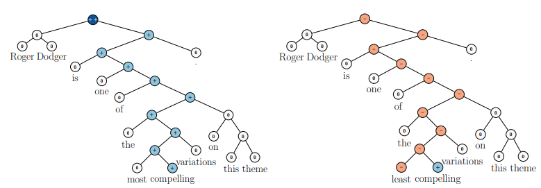
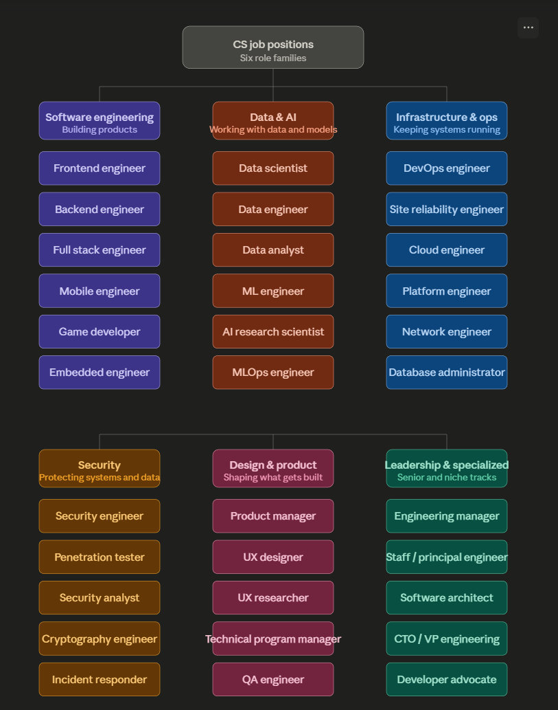

# Where everything starts

## What is it?
This note follows the **semantic tree hierarchical structure**, that organizes concepts by their meaning and relationship, moving from core fundamentals to fine details. 

Same idea applies to First Principle Thinking. It reasons everything up from the more fundamental truths.

<small>Sentiment Tree and RNTN Prediction, Socher et al, 2013</small>

### Why we need computer?
Human hardware is so insufficient and slow. 

Human being are so weak in computing and memory. For example, if we need to do `199 X 577`, we need at least 30 second to solve, but for computer, it only takes 3ms.

### Why computer has to be binary?
Cause it is the reliable way to run computation by electricity in physics. 

Of cause, there is computer using Ternary, but it is unstable. 

The hardware is reliable on billions of transistors
- Current is on, means 1
- Current is off, means 0

## The Six role families

### Software engineering
- [FrontEnd](SoftwareEng/FrontEnd.md)
- [BackEnd](SoftwareEng/BackEnd.md)
- [Mobile](SoftwareEng/Mobile.md)
- [System Architecture](SoftwareEng/systemArchitect.md)

### Data & AI
- [AI](Data&AI/AI.md)

### Infrastructure & ops
- [DevOps](Infra&Ops/DevOps.md)
- [OS](Infra&Ops/OS.md)

### Security
- [N/A]()

### Design & Product
- [N/A]()

### Leadership & Specialized
- [N/A]()