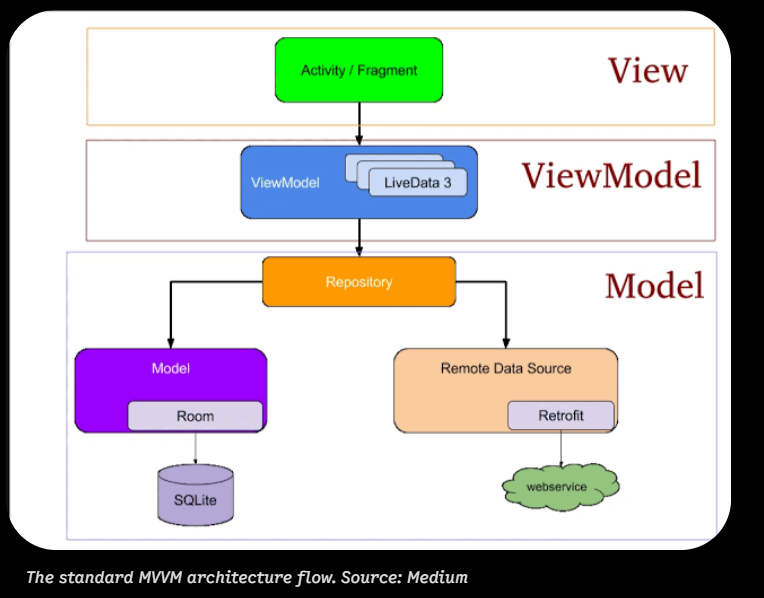

# Android

## Goal of android architecture?
- Architecture must be consistent. No fail.
- Divide the jobs into layers. Easy to fix bug and debug.
- Stay open for architecture choice. Some structure might be better for one situation.
- Simplicity over complicity.

## Android Studio Scope Selector?
In android studio, there are multiple scope selector, "Project, Android, Project File, ..etc" 

They all refer to the same folder, but showing a different lens/view to developer for specific jobs. 

If you need to code on kotlin, better using Android View. If you need to check the file structure, better using Project View. 

## Which file is blueprint for OS in Android APP?
The system will read the `AndroidManifest.xml` first, it's the root of app's package, without this file, the OS has no idea of what app's contains, and how to run. 

1. name of the app
2. which activities exist
3. the hardware component permissions
4. result of users's screen tap

It's like your APP identity card (An ID card of your app). Configure how Android launch your app. 

## Why Android development needs gradle?
Gradle is a build automation tool. It's job is to take your `dependencies + source code + configuration`, to produce a runnable artifact. 

Same principle/steps while running android application. 

## Which folder is the Global Entry Point?
`AssetManagerApplication.kt` as the starting point

Next is `MainActivity.kt`, application will start here. 

## Which file config your application code?
`app/build.gradle.kts`

## Why there're two build gradle files?
For building two components in different scale. 

- The build gradle file under root directory is `/build.gradle.kts`, it's a project level file, it builds android outside your application.

- The build gradle in your app is `/app/build.gradle.kts`, it's module-level file, it's actually building your app logic. 

## Which folder contains all the layout setting?
`res/layout`

## How secrets.properties protect your KEY?
When in android dev, put your api key into your `secrets.properties`, and use git ignore tool to avoid being uploaded. 

- gradle plugin will read `secrets.properties`, put your key into `BuildConfig`
- compiler will tranfer your key into Dalvik bytecode, the `.dex` file as string variable

You can not use reverse-engineering to get the key. 

## Why package name com.example?
It's purely a path on your disk. 

A decade ago, Java designer need a way to create a unique package to separate from people coordinating. They use the domain name they own, and reverse it. 

The name itself is a placeholder domain, when you push your real app on Google Play Store, you should change it to your domain you actually control. 

## Why XML file become canvas in Android Studio?
ALL Android XML is text. 

Android Studio just gives you smart previews for that XML file. 

Those XML need to work with Kotlin in order to present UI automation. XML defines the static skeleton. Kotlin handles dynamic, behavioral, and data logic. 

## What's three parts in macro-layer of Android?
1. `presentation/` — anything the user sees or touches (Activities, Fragments, Dialogs, ViewModels)
2. `domain/` — pure business logic, no Android imports, no network code (use cases, agent orchestration rules)
3. `data/` — how data is fetched and stored (HTTP clients, databases, API definitions, parsers)

it's Google recommend app architecture

- `data/`-- How to get the data?

- `domain/`-- How to deal with those data?

- `presentation/`-- How we present to user?

In most examples, in kotlin + Java section,
UI Layer           →    presentation/
Domain Layer       →    domain/
Data Layer         →    data/

The core of Android App dev, only 3 things
1. shows stuff to user (UI part)
2. Decides what to do with input (Business Rules)
3. Get/saves data (network, database, files)

## What's MVVM?
Google itself recommends MVVM(Model-View-ViewModel) as the official android architecture. It's the standard pattern for organizing user view (The '/presentation' layer)

- `model`, where is your data?
- `view`, what shows to user?
- `viewmodel`, combined both and show to user

`ViewModel` is like a middleman, transfer data between `model` and `view`. 

The files
1. The View (IndexFragment.kt), pure display which is connectes to the XML layout, display when data in and out. 
2. The ViewModel(IndexViewModel.kt), the bridge between you presenting UI, and backend database
3. The State (AssetUiState.kt),defining the boundaries and rules of screen

## What is di and utils folder?
You can deprioritize those two folders in default structure

`di/` — Dependency Injection (Hilt)

`utils/` — Generic Helpers

## Kotlin compare to Java?
Kotlin runs on the JVM, the same runtimes as Java, the Kotlin source code (kt code) still compiled down to JVM .class file, so they both identical in physical level. 

But Kotlin adds a few thing java doesn't have. 

## What's Android Desugaring?
Core library desugaring is an Android build process that enables developers to use modern Java APIs (such as java.time, java.util.stream, and java.util.Optional) on older Android devices that do not natively support them. 

## Difference between kt file and xml file?
`.kt` is a programming language. (little differ from java)

`.xml` is markup language, just a static blueprint. 

## What's Android DOM
the `android document object model` (DOM), it's an API use, to parse XML by loading entire environment into RAM, and create a tree structure. 

## How XML works with Kotlin?
The bridge between them is R class, `import com.example.assetmanager.R`

When you build your project, android build tool will scan your `res/` folder, and generate `R.java`.

When you use `R.id.XXXXX`, which's just a number, is the handle to reach to xml file, to grab the view object.

## What is TextView class?
TextView is a class in `android.widget.TextView`, it's a container of 3 things bundled:

1. memory slot for text
2. formatting rule
3. the draw()

the static object is defined by XML file, it defines what TextView should looks like.

All the content shown is from Kotlin, 

## Which database Android app will choose?
The most used database is Android App is SQLite. 

## Will Gradle compile in mobile?
No, gradle as a building tool only runs on development machine, your laptop or PC. 

It has zero involvement once APK is built. Phone runs app doesn't need Gradle.  

## Environment setting in android dev?
3 things must be identical:

- gradle wrapper version
- SDK version (software development kit)
- JDK version (Java related)

Android SDK is like the material (You're building the android app, so you need android component), while Gradle is like a assembly line, it's automation tool. 

Gradle and android material to gather your source code, while you're building android, it combined with Android component, to become Android APP (.apk)

Both tool is written in Java, so it needs JVM to run, and java package to support. That's why we need JDK.

## What's signingConfig in app/build.gradle?
In `app/build.gradle`, which is the configuration of how to build your application. `SigningConfig` is one of the components. 

Each android APP (.apk or .abb), it needs the cryptographically signed before it can be installed on device OR upload to Google Play. 

It's saying that this update come from the same developer as first release. 

## Which function setting developer mode?
AppConfig.isDevelopmentMode()

